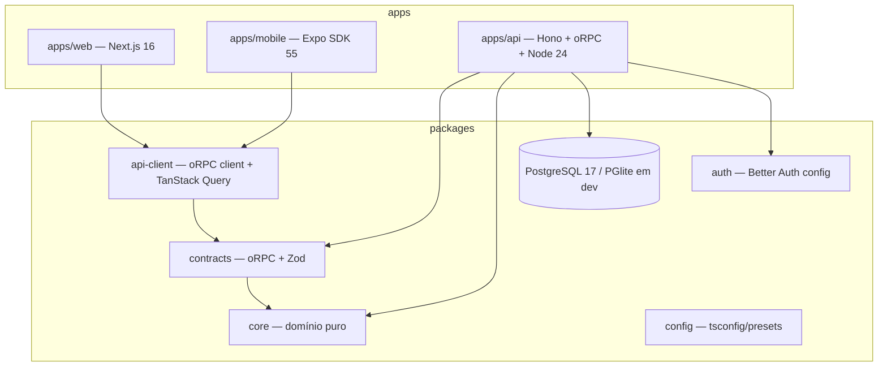

# Arquitetura — MotusFit

## Visão geral

**Monólito modular** em monorepo TypeScript, com type safety ponta a ponta via contratos compartilhados. Três apps (API, web, mobile) consomem pacotes compartilhados de domínio, contratos e cliente de API.



## Camadas na API (Clean Architecture pragmática)

Cada módulo (bounded context — ver [domain-model.md](domain-model.md)) segue **feature-based organization** com três camadas internas:

```
apps/api/src/modules/<context>/
  <feature>/
    <feature>.handler.ts     # adaptação HTTP: implementa o procedimento oRPC, chama o use case
    <feature>.usecase.ts     # orquestração: regras de aplicação, transação, autorização de recurso
    <feature>.usecase.test.ts
  <context>.repository.ts    # acesso a dados (Drizzle) — única camada que importa `db`
  index.ts                   # router oRPC do módulo
```

Regras de dependência (a seta aponta para quem PODE importar quem):

```
handler → usecase → repository → drizzle
   ↓         ↓
contracts   core (regras puras: cálculos de macro, volume, kcal)
```

- **`packages/core`** é TypeScript puro, sem dependência de framework, ORM ou HTTP — 100% testável em unit test. Toda regra de cálculo (macros, volume, METs, semana ISO) vive aqui e é usada por API **e** clientes (ex.: totais otimistas na UI).
- **Use cases** recebem dependências por parâmetro (injeção manual via factory por módulo — sem container de DI; KISS). Retornam dados ou erros tipados (`Result`-like via exceções de domínio mapeadas no handler).
- **Repositories** encapsulam Drizzle; nenhum handler/use case escreve SQL.
- **Sem CQRS formal**: leituras de agregação (stats/dashboard) são queries dedicadas no repository — separação natural de leitura/escrita sem barramento. Se um dia leituras exigirem projeções, registra-se ADR.

## Contrato e type safety ponta a ponta

- **`packages/contracts`** define os procedimentos oRPC contract-first: input/output em **Zod 4**, agrupados por contexto (`nutrition.*`, `workout.*`, `stats.*`, `identity.*`).
- A API implementa o contrato; `packages/api-client` deriva o cliente tipado + helpers TanStack Query. Web e mobile importam o mesmo cliente.
- **OpenAPI 3.1** é gerado do contrato e servido em `/api/v1/docs` (Scalar UI) — documentação automática sem esforço extra.
- **Versionamento**: prefixo de caminho `/api/v1`. Mudanças breaking exigem `v2` + ADR; aditivas são permitidas em `v1`.

## Autenticação

Better Auth roda **dentro da API** (rotas `/api/auth/*`), sessões em cookie (web) e secure storage via plugin Expo (mobile). Procedimentos oRPC usam middleware que injeta `session`/`user` no contexto; procedimentos protegidos por padrão (públicos são exceção explícita). Detalhes em [security.md](security.md) e [ADR 0004](adr/0004-auth.md).

## Dados

PostgreSQL 17 (produção: Postgres gerenciado — Neon/Supabase/RDS; decisão de hosting adiada até o deploy, sem impacto no código). Dev e testes usam **PGlite** (Postgres real em WASM, in-process, zero Docker). Schema/migrations no `packages/db` via drizzle-kit. Ver [database.md](database.md).

## Fronteiras e evolução prevista

| Necessidade futura | Ponto de extensão já preparado |
|---|---|
| Wearables / Health sync | Novo módulo `integrations`; webhooks como rotas Hono adicionais; contratos aditivos em `v1` |
| IA (sugestões, foto de refeição) | Novo módulo consumindo `core` + APIs externas; nenhuma mudança nas camadas |
| Premium/billing | Plugin Stripe do Better Auth + campo `plan` no user (já modelado) |
| Notificações / comunidade | Eventos de domínio demarcados ([domain-model.md](domain-model.md)); adicionar outbox + worker quando necessário |
| Offline-first mobile | Hoje: TanStack Query com persistência (MMKV) e mutações otimistas. Evolução: expo-sqlite + Drizzle no device (mesmo dialeto do backend) + sync engine (PowerSync/Electric). Regras em `core` já rodam no cliente |
| Escala de leitura | Repositories isolam SQL → índices/materialized views sem tocar use cases |
| Extração de serviço | Contextos não compartilham tabelas nem imports cruzados de escrita |

## Princípios aplicados (e seus limites)

- **Clean Architecture**: direção de dependência estrita, mas **3 camadas, não 5** — sem interfaces espelhadas nem mapeamento DTO↔entity redundante quando o tipo Zod do contrato serve.
- **DDD**: linguagem ubíqua, agregados e invariantes; **sem** event sourcing, sem repositórios genéricos.
- **SOLID/KISS/DRY**: regra prática — abstração só nasce no segundo uso concreto.
- **Feature-based**: código agrupado por funcionalidade, não por tipo técnico.
