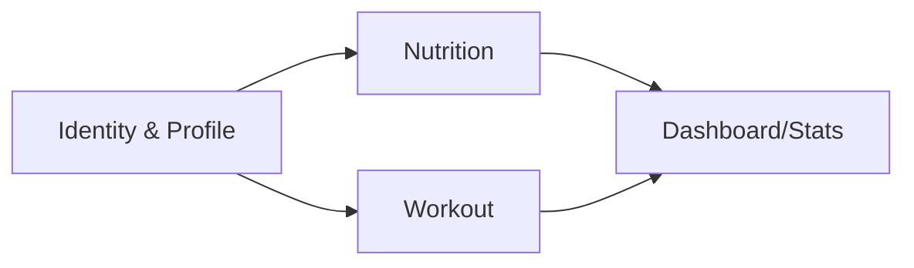

# Modelo de Domínio — MotusFit

Modelagem orientada a DDD **leve**: usamos linguagem ubíqua, agregados e invariantes explícitas, sem cerimônia desnecessária (ver princípios em [architecture.md](architecture.md)). O schema físico está em [database.md](database.md).

## Bounded contexts

| Contexto | Responsabilidade | Módulo na API |
|---|---|---|
| **Identity & Profile** | Conta, autenticação, perfil (peso corporal, metas), plano (free/premium futuro) | `modules/identity` |
| **Nutrition** | Alimentos, diário alimentar, macros, metas diárias, favoritos/recentes | `modules/nutrition` |
| **Workout** | Exercícios, rotinas, sessões, séries, volume, gasto calórico | `modules/workout` |
| **Dashboard/Stats** | Agregações read-only cruzando contextos (dia atual, semana) | `modules/stats` |

Contextos se comunicam **apenas por IDs e leituras** (Stats lê dos outros); nenhum contexto escreve em tabela de outro. Isso permite extração futura em serviços se necessário — sem prometer microservices agora.

## Linguagem ubíqua

- **Food** (alimento): item nutricional com macros por porção base. `source: user | catalog` (catálogo público entra pós-MVP).
- **Diary Entry** (entrada do diário): um alimento + quantidade em um **Meal Slot** (`breakfast | lunch | dinner | snack`) de um dia.
- **Nutrition Goal** (meta diária): kcal + macros alvo do usuário, com vigência (histórico de metas preservado).
- **Exercise**: movimento (ex.: supino reto) com grupo muscular e equipamento. `source: user | catalog`.
- **Routine** (rotina): template ordenado de **Routine Exercises** com prescrição (séries alvo, faixa de reps, descanso).
- **Workout Session** (sessão): execução concreta (de uma rotina ou livre) com **Sets** registrados.
- **Set** (série): reps × carga (kg) de um exercício dentro da sessão; `completed` distingue planejado de feito.
- **Volume**: Σ(carga × reps) das séries completas.

## Agregados e invariantes

### Nutrition

- **Food** (raiz) — invariantes: macros ≥ 0; porção base > 0.
- **DiaryDay** (conceitual; fisicamente `diary_entries` por `(userId, date)`) — invariantes: quantidade > 0; entrada sempre referencia Food existente; totais do dia são **derivados**, nunca armazenados (calculados na leitura — volume de dados do MVP não justifica denormalização; ver ADR se mudar).
- **NutritionGoal** — invariantes: valores > 0; no máximo uma meta vigente por usuário (nova meta encerra a anterior).

### Workout

- **Exercise** (raiz) — invariante: nome único por usuário (entre os custom).
- **Routine** (raiz, contém RoutineExercise) — invariantes: ordem sem buracos; exercício não duplicado na rotina; prescrição válida (séries ≥ 1, reps ≥ 1, descanso ≥ 0).
- **WorkoutSession** (raiz, contém Sets) — invariantes: `finishedAt ≥ startedAt`; sets pertencem a exercícios da sessão; carga ≥ 0, reps ≥ 1; sessão concluída não aceita novos sets (edição posterior é update explícito, não fluxo de execução).

### Identity

- **User** — e-mail único; peso corporal atual (kg) usado por Workout para estimar kcal (lido via perfil, não duplicado).

## Regras de cálculo (fonte da verdade)

- **Macros do dia**: Σ(macro_por_porção × quantidade/porção_base) por entrada. Arredondar só na apresentação (g: 1 casa; kcal: inteiro).
- **Volume da sessão**: Σ(carga × reps) para sets `completed`.
- **Gasto calórico da sessão** (estimativa): `kcal = MET × peso_kg × duração_horas`, MET default 5.0 (musculação, esforço moderado — Compendium of Physical Activities, código 02052). MET por sessão configurável no futuro; valor e fórmula ficam em `packages/core` (domínio compartilhado), testados unitariamente.
- **Estatísticas semanais**: semana ISO-8601 (segunda a domingo), no fuso do usuário (perfil guarda `timezone`, default do device).

## Eventos de domínio (pós-MVP, já previstos)

O MVP **não** implementa event bus. Mas os pontos de emissão ficam demarcados (método de domínio único por mutação relevante) para plugar depois: `SessionCompleted`, `DiaryEntryAdded`, `GoalUpdated` → alimentarão notificações, gamificação e sync com wearables.
